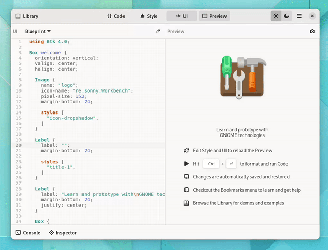

# Workbench

Learn and prototype with GNOME technologies



<a href='https://beta.flathub.org/apps/details/re.sonny.Workbench'></a>

Workbench goal is to let you experiment with GNOME technologies, no matter if tinkering for the first time or building and testing a GTK user interface.

Among other things, Workbench comes with

- realtime GTK/CSS preview
- library of examples
- JavaScript and Vala support
- XML and Blueprint for describing user interface
- syntax highlighting, undo/redo, autosave, session restore
- code linter and formatter
- terminal output
- 1000+ icons

ℹ️ Workbench is made possible by Flatpak. Only Flathub Workbench is supported.

**Testimonials**

> **“** It is an essential tool for those who develop applications with GTK **”** • **“** as someone who is learning GTK, Workbench is definitely a must have! **”** • **“** created a simple mockup using the amazing Workbench app **”** • **“** It used to be hard but Workbench helps me learn GTK. **”** • **“** I recommend it even to those who are new to GTK **”** • **“** This tool has simplified my life by saving my time drastically. **”** • **“** Gone too wild playing with Workbench **”**

## Tips and tricks

<details>
  <summary>Disable code formatting</summary>

Workbench uses the [prettier](https://prettier.io/) code formatter. If you need to exclude some code you can use special comments.

[JavaScript](https://prettier.io/docs/en/ignore.html#javascript)

```js
// prettier-ignore
matrix(
  1, 0, 0,
  0, 1, 0,
  0, 0, 1
);
```

[CSS](https://prettier.io/docs/en/ignore.html#css)

```css
/* prettier-ignore */
.my    ugly rule
{

}
```

</details>

<details>
  <summary>Turn a prototype made in Workbench into an application</summary>

Use GNOME Builder to start a new project using the appropriate GNOME Application template and copy paste your Workbench code.

</details>

## Credits

Workbench would not be possible without

Flatpak, GTK, GLib, GtkSourceView, libadwaita, VTE, GJS, Blueprint, icon-development-kit, Vala

and the GNOME community 🖤

## Copyright

© 2022 [Sonny Piers](https://github.com/sonnyp) and contributors

## License

GPLv3. Please see [COPYING](COPYING) file.

Except for everything under src/Library/demos which is in the public domain under the terms of [CC0 1.0](https://creativecommons.org/publicdomain/zero/1.0/).

<details>
  <summary>
    Testimonials
  </summary>

From [Mirko Brombin](https://mirko.pm/) creator of [Bottles](https://usebottles.com/)

> My favorite tool is definitely Workbench, an application that allows me to compose GTK interfaces with XML/Blueprint, JavaScript, and CSS, seeing the results in real-time. This tool has simplified my life by reducing my time drastically. It is an essential tool for those who develop applications with GTK and I recommend it even to those who are new to GTK.

https://console.substack.com/p/console-112

---

From [Marco Melorio](https://twitter.com/melix9999) creator of [Telgrand](https://github.com/melix99/telegrand)

> GSoC coding period started on Monday, so this is a good time to blog about what I’ve started working on and what’s my milestone to finish the project. First off, I’ve created a simple mockup using Sonny Piers’ amazing Workbench app. This is the first step in knowing how we want the UI to look like, at least in the first iteration.

https://melix99.wordpress.com/2022/06/17/gsoc-update-1-planning/

---

> Workbench has been great! It used to be hard to mess around with GTK but Workbench helps me to learn GTK.

https://twitter.com/synthesizedecho/status/1528958932911280129

> Gone too wild playing with Workbench and Blueprint.

https://mastodon.online/@waimus/108582108701889960

> as someone who is learning GTK, I can confirm that Workbench is definitely a must have for me!

https://fosstodon.org/@TheEvilSkeleton/108598098682948266

</details>
