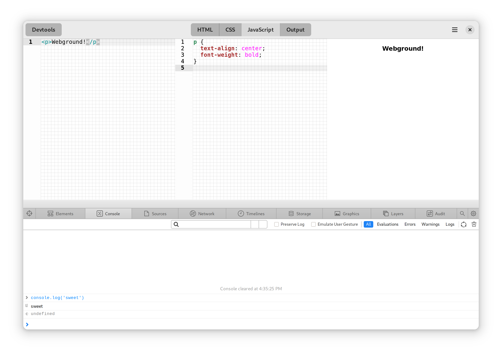

# Workbench

A sandbox to learn and prototype with GNOME techologies



<a href='https://flathub.org/apps/details/re.sonny.Workbench'></a>

Workbench goal is to let you experiment with GNOME technologies, no matter if tinkering for the first time or building and testing a custom GTK widget.

Among other things, Workbench comes with

- realtime GTK/CSS preview
- JavaScript for quick and easy scripting
- Syntax highlighting, undo/redo, autosave
- code fomatter
- terminal

## Tips and tricks

<details>
  <summary>Disable code formatting</summary>

Workbench uses the [prettier](https://prettier.io/) code formatter. If you need to exclude some code you can use special comments.

[JavaScript](https://prettier.io/docs/en/ignore.html#javascript)

```js
// prettier-ignore
matrix(
  1, 0, 0,
  0, 1, 0,
  0, 0, 1
);
```

[XML](https://github.com/prettier/plugin-xml#ignore-ranges)

```xml
<foo>
  <!-- prettier-ignore-start -->
    <this-content-will-not-be-formatted     />
  <!-- prettier-ignore-end -->
</foo>
```

[CSS](https://prettier.io/docs/en/ignore.html#css)

```css
/* prettier-ignore */
.my    ugly rule
{

}
```

</details>

## Development

1. Install [GNOME Builder](https://apps.gnome.org/app/org.gnome.Builder/)
2. Open Builder and select "Clone Repository..."
3. Clone `https://github.com/sonnyp/Workbench.git`
4. Press the Run ▶ button

## Packaging

Please do not attempt to package Workbench any other way than as a Flatpak application.

It is unsupported and may put users at risk.

## Contributing

If you can help, here is a list of issues that would make Workbench better

- [GtkSourceView - Make URIs clickable](https://gitlab.gnome.org/GNOME/gtksourceview/-/issues/125)

## Copyright

© 2022 [Sonny Piers](https://github.com/sonnyp)

## License

GPLv3. Please see [COPYING](COPYING) file.
